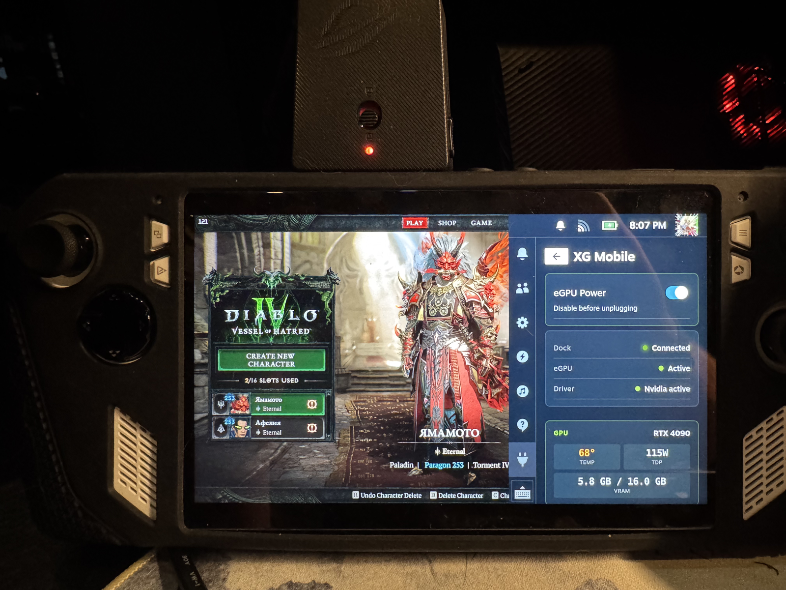

# XG Mobile Linux Driver

> RTX 4090 on a ROG Ally running SteamOS — one-click install via Decky Loader.

[](https://store.steampowered.com/steamos)
[](https://gitlab.steamos.cloud/jupiter/linux-integration)
[](https://www.nvidia.com/Download/index.aspx)
[](https://developer.nvidia.com/cuda-downloads)
[](LICENSE)


*Diablo IV — RTX 4090 on a ROG Ally Z1 Extreme, eGPU active, plugin live in QAM.*

---

## What this is

A working ASUS XG Mobile eGPU on **SteamOS 3.8** packaged as a **Decky Loader plugin**. After install you get an XG Mobile entry in the Quick Access Menu with **Activate / Deactivate / Status / Launch options**. nvidia-dkms is built and bound to the eGPU, both AMD iGPU and NVIDIA dGPU are visible to Vulkan, and CUDA works.

> ⚠️ **Use at your own risk.** This modifies SteamOS system files (nvidia-dkms, pacman, modprobe config, sudo). Tested on a **single device** — ROG Ally Z1 Extreme + GC33Z (RTX 4090). SteamOS A/B updates can wipe nvidia-dkms — reinstall via the plugin, it's idempotent. **Never** add `nvidia` to `modules-load.d/` — it loads at every boot and breaks the system the day you forget the dock at home.

## Table of contents

- [Proof](#proof)
- [How it works](#how-it-works)
- [Install](#install)
- [Usage](#usage)
- [CUDA / ML](#cuda--ml)
- [External monitor](#external-monitor)
- [Known issues](#known-issues)
- [Hardware compatibility](#hardware-compatibility)
- [Project structure](#project-structure)
- [Credits](#credits)

## Proof

```text
+-----------------------------------------------------------------------------------------+
| NVIDIA-SMI 575.64.05              Driver Version: 575.64.05      CUDA Version: 12.9     |
|   0  NVIDIA GeForce RTX 4090 ...    Off |   00000000:01:00.0 Off |                  N/A |
| N/A   52C    P8              9W /  115W |      15MiB /  16376MiB |      0%      Default |
+-----------------------------------------------------------------------------------------+

=== System ===
Linux steamdeck 6.16.12-valve15-1-neptune-616 #1 SMP PREEMPT_DYNAMIC x86_64 GNU/Linux

=== Vulkan GPUs ===
  deviceName = AMD Ryzen Z1 Extreme (RADV PHOENIX)
  deviceName = NVIDIA GeForce RTX 4090 Laptop GPU
```

| Metric | Value |
|--------|-------|
| FP32   | 19.1 TFLOPS (PyTorch CUDA 12.9) |
| FP16   | 52.3 TFLOPS |
| Games  | Diablo IV (max + DLSS FG), Diablo II Resurrected (120 FPS locked) |

More screenshots:
[KDE about-system view](screenshots/01-system-info.png) ·
[D4 adapter selection = RTX 4090](screenshots/03-d4-adapter-rtx4090.png) ·
[D4 in-game with VRAM usage](screenshots/04-d4-gameplay-vram.png) ·
[MangoHud overlay on eGPU render](screenshots/05-d4-mangohud.png)

## How it works

The XG Mobile connector is **PCIe behind a software lock**. On the ROG Ally Z1 Extreme it negotiates as **PCIe 3.0 x4** (verified via `lspci -vv` — `LnkCtl2 Target Link Speed: 8GT/s`, `LnkSta Width: x4`). The marketed "PCIe 4.0 x8" describes the connector itself; on Ally the APU only has 4 free Gen3 lanes for the dock. ROG Flow X13/X16 likely negotiate wider — would appreciate `lspci` output from those if you have one. On Windows ASUS Armoury Crate runs a handshake to release power and bus. On Linux nothing of the sort is needed — the SteamOS kernel already ships `asus-wmi` with `egpu_enable`, so the entire activation sequence is just:

```bash
echo 1 > /sys/devices/platform/asus-nb-wmi/egpu_enable   # ACPI: power + PCIe up
echo 1 > /sys/bus/pci/rescan                              # kernel discovers GPU
modprobe nvidia nvidia-uvm                                # driver binds
modprobe nvidia-drm modeset=1                             # DRM at runtime only
nvidia-smi                                                # RTX 4090 ready
```

That's the whole "driver". The plugin automates installation, activation, and safe shutdown. **`nvidia-drm` is intentionally not loaded at boot** — modeset at boot would steal the display from the AMD iGPU and produce a black screen the first time you forget the dock.

## Install

### Quick install via Decky URL (easiest)

If you have **Decky Loader's developer mode** enabled (Settings → General → Developer mode), this is a one-click flow:

1. Decky → Settings → **Custom URL** (under Developer)
2. Paste:
   ```
   https://github.com/stensmir/xg-mobile-linux/releases/latest/download/XG-Mobile.tar.gz
   ```
3. Decky downloads, unpacks, and restarts the plugin loader. Open QAM → XG Mobile → **Setup**.

No SSH, no git, no terminal. Works for both NVIDIA and AMD docks (the install path is chosen in Setup).

### Via Decky Loader (recommended)

**Prerequisites:**
- ROG Ally / Ally X running SteamOS 3.8+ (beta channel)
- ASUS XG Mobile dock connected at boot
- [Decky Loader](https://decky.xyz/) installed
- SSH on the Ally (Desktop Mode → Konsole → `passwd && sudo systemctl enable --now sshd`)
- A `sudo` password set for the `deck` user

**From your PC:**
```bash
ssh deck@<ally-ip> "git clone https://github.com/stensmir/xg-mobile-linux.git /tmp/xgm && \
  sudo cp -r /tmp/xgm/decky-plugin/XG-Mobile ~/homebrew/plugins/ && \
  sudo chown -R deck:deck ~/homebrew/plugins/XG-Mobile && \
  sudo systemctl restart plugin_loader.service"
```

**On the Ally:** open QAM → Decky → XG Mobile → **Setup** (enter sudo password once) → choose your dock:
- **Install for NVIDIA dock** (GC31R/S, GC33Y, GC33Z, USB-C 5090) — builds nvidia-dkms, ~15 minutes. Reboot when prompted.
- **Install for AMD dock (GC32L)** — short install: just auto-detect + safe-shutdown services. amdgpu is already in the SteamOS kernel. **Experimental** — confirmed only at the activation level; if anything breaks, hit "Copy diagnostics" in QAM and open an issue.

After reboot the dock auto-detect service loads nvidia only when the dock is connected, so the Ally is safe to boot standalone (AMD iGPU only).

### Via Claude Code (automated)

If you have [Claude Code](https://docs.anthropic.com/en/docs/claude-code), see [CLAUDE_CODE_PROMPT.md](CLAUDE_CODE_PROMPT.md) — it SSHes into your Ally and runs the whole pipeline.

## Usage

The plugin's QAM panel exposes:
- **Activate eGPU** — ACPI write → PCIe rescan → load nvidia
- **Deactivate eGPU** — safe driver/PCIe teardown before unplug (run this *before* pulling the cable)
- **Status** — dock connection, eGPU bound, driver alive, GPU stats
- **Copy launch options** — clipboard with recommended Proton env vars

### Steam launch options

Add to a game's properties → Launch Options:
```
DXVK_FILTER_DEVICE_NAME="RTX 4090" PROTON_ENABLE_NVAPI=1 DXVK_ENABLE_NVAPI=1 %command%
```
- `DXVK_FILTER_DEVICE_NAME` — force DX titles onto the eGPU instead of the iGPU.
- `PROTON_ENABLE_NVAPI` + `DXVK_ENABLE_NVAPI` — enable DLSS / Frame Generation / NVIDIA extensions inside Proton prefixes.

## CUDA / ML

```bash
python3 -m venv ~/cuda-env
TMPDIR=~/tmp ~/cuda-env/bin/pip install torch --index-url https://download.pytorch.org/whl/cu128
~/cuda-env/bin/python3 -c "import torch; print(torch.cuda.get_device_name(0))"
# -> NVIDIA GeForce RTX 4090 Laptop GPU
```

PyTorch 2.x with CUDA 12.x runs natively against `nvidia-dkms 575`. No compatibility layer.

## External monitor

| Mode | Status |
|------|--------|
| **Desktop Mode (KDE Plasma)** | ✅ Works out of the box. KWin holds DRM masters on both cards; `card1-HDMI-A-1` / DP outputs are driven by nvidia. Use System Settings → Display Configuration. |
| **Game Mode (gamescope)** | ❌ Not supported. gamescope opens the first DRM device by `boot_vga=1` (= AMD iGPU) and never enumerates connectors on the nvidia card. `--prefer-vk-device` and `VULKAN_ADAPTER` only steer the Vulkan render device, not the DRM scanout device. |

Game Mode external display is an open architectural limitation in [gamescope](https://github.com/ValveSoftware/gamescope) (see issues like [#1643](https://github.com/ValveSoftware/gamescope/issues/1643)). For now: launch games from Desktop Mode if you want a 4K external monitor.

## Known issues

| Issue | Workaround |
|-------|-----------|
| SteamOS A/B update wipes nvidia-dkms + plugin systemd units | Reinstall via plugin — idempotent, scripts/units ship inside the plugin bundle |
| D4 freezes on Bink intro cutscenes (Proton) | Skip intro, or install `mf-install` via protontricks |
| DKMS build fails: "No space left on device" | rootfs is 5 GB — plugin symlinks `/var/lib/dkms` to `/home` automatically |
| `pacman-key` errors after image update | Plugin reinitialises the keyring on install (step 2) |
| `follow_pte` kernel WARN during GPU unplug | Upgrade to kernel 6.16+ AND nvidia 575+ — older combos break |
| Black screen on boot without dock | Don't add `nvidia` to `modules-load.d/` — let the auto-detect service handle it |
| External monitor blank in Game Mode | gamescope architectural limitation — use Desktop Mode |

**Always run Deactivate before unplugging.** Hot-unplug while `nvidia-drm` is loaded can hang the system.

## Hardware compatibility

**Confirmed working:**
- ROG Ally Z1 Extreme + XG Mobile GC33Z (RTX 4090 Laptop GPU, 16 GB)
- SteamOS 3.8.2 beta, kernel `6.16.12-valve15-1-neptune-616`
- nvidia-dkms 575.64.05, CUDA 12.9

**Should also work** (any ROG device with the XG Mobile connector + `asus-nb-wmi`):

| Dock | GPU | Status |
|------|-----|--------|
| GC31R | RTX 3080 Mobile | Should work (NVIDIA path) |
| GC31S | RTX 3080 Ti | Should work (NVIDIA path) |
| GC32L | RX 6850M XT (AMD) | **Experimental AMD path** — activation verified by community on Bazzite, plugin path untested on stock SteamOS. Use "Copy diagnostics" + open issue if you try it. |
| GC33Y | RTX 4090 Mobile | Should work (NVIDIA path) |
| GC33Z | RTX 4090 | **Confirmed (NVIDIA path)** |
| USB-C XG Mobile (e.g. RTX 5090) | RTX 5090 | Should work — same `asus-wmi` path |

## Project structure

```
xg-mobile-linux/
├── decky-plugin/XG-Mobile/      # Decky plugin (primary deliverable)
│   ├── main.py                  # backend: install / activate / deactivate
│   ├── src/                     # TypeScript frontend (rollup-built)
│   ├── dist/                    # built JS shipped to Decky
│   ├── scripts/                 # shipped with the plugin, installed on device
│   │   ├── xgm-auto             # auto-detect: load nvidia only when dock connected
│   │   └── xgm-shutdown         # safe nvidia unload on poweroff/reboot
│   ├── systemd/                 # service units installed by the plugin
│   │   ├── xg-mobile-auto.service
│   │   └── xg-mobile-shutdown.service
│   └── plugin.json
├── screenshots/                 # photos of the working setup
├── CLAUDE_CODE_PROMPT.md        # automated install via Claude Code
└── README.md
```

Scripts and systemd units live **inside** the plugin so installation works offline / with private repos. Decky Loader copies the whole bundle, and the plugin uses `install -m` from its own directory rather than fetching files at runtime — a previous version `curl`-ed them from GitHub which broke for everyone behind auth or air gaps.

## Credits

- Protocol reverse engineering: [osy/XG_Mobile_Station](https://github.com/osy/XG_Mobile_Station)
- asus-linux kernel patches: [asus-linux.org](https://asus-linux.org)
- Valve for shipping the SteamOS kernel with `asus-wmi` + `egpu_enable`
- [Decky Loader](https://decky.xyz/) — the plugin platform
- [ewagner12/all-ways-egpu](https://github.com/ewagner12/all-ways-egpu) — reference for compositor variable hints

## License

MIT — do whatever. No warranty.
