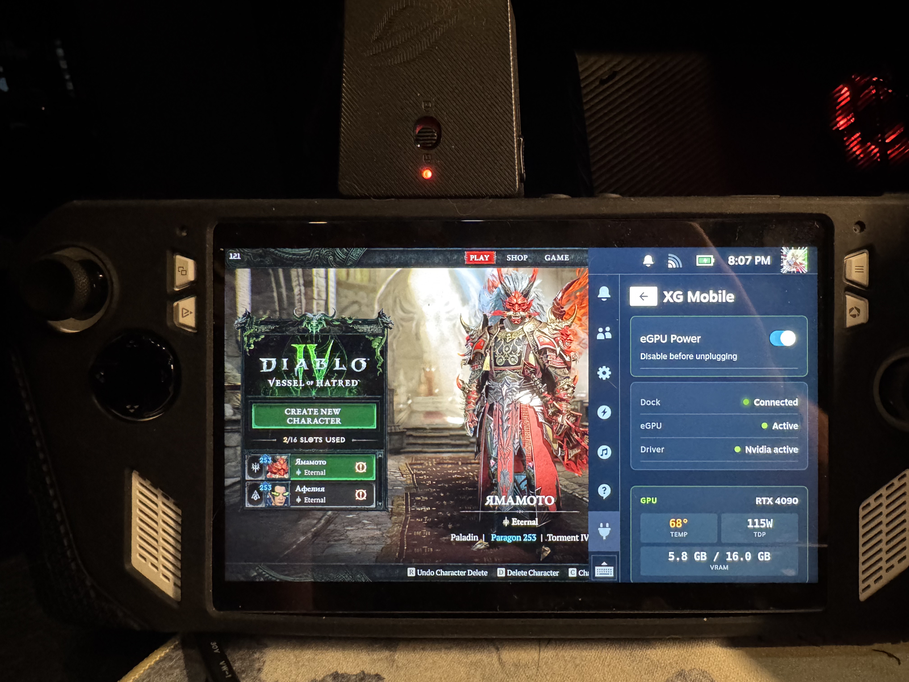

# XG Mobile on SteamOS

ASUS XG Mobile GC33Z (RTX 4090 Laptop, 16 GB) on ROG Ally Z1 Extreme, with a Decky plugin and recovery scripts.

[](https://store.steampowered.com/steamos)
[](RECOVERY-2026-09-07.md)
[](CHANGELOG.md)
[](LICENSE)

## September 2026 update

**External HDMI now verified working at 3840×2160 / 60 Hz in Desktop Mode (Plasma Wayland).** Path of Exile 2 runs on the RTX 4090 through Proton 11.0 and Steam Linux Runtime 4. SteamOS remains on 3.8.26; no Preview switch was needed.

After an A/B system update removed the working driver, NVIDIA 575.64.05 needed a small kernel 6.18 compatibility patch. The patched driver built successfully, the dock activated after reboot, and both a test pattern and actual gameplay appeared on the external monitor.

**Game Mode external output is still unresolved.** The working display path is Desktop Mode. We did not install a persistent gamescope override or establish that a gamescope upgrade fixes this.

See [release changes](CHANGELOG.md) and the [recovery record](RECOVERY-2026-09-07.md) for exact versions, tests, backups, and limitations.

## External monitor workflow

1. Connect the dock and monitor before starting the session.
2. In Steam, choose **Power → Switch to Desktop**.
3. Use KDE **System Settings → Display Configuration** to select the external display and resolution.
4. Open Steam in Desktop Mode and launch the game.

The command used to switch on the tested system was:

```sh
steamosctl switch-to-desktop-mode plasma.desktop
```

Return using `steamosctl switch-to-game-mode`. The default login remains Game Mode.

| Display path | Verified result |
|---|---|
| Plasma Wayland → NVIDIA HDMI | Visible 4K60 output and PoE 2 gameplay |
| Main Game Mode session | Used AMD/internal display; external output not established |
| Second DRM gamescope alongside Steam | Could not acquire the occupied logind seat |
| Legacy DRM test pattern | Visible 1080p HDMI pattern |

DRM card and connector numbers can change after reboot. Prefer `/dev/dri/by-path/` when diagnosing. A successful `modetest` exit alone does not prove a monitor received a frame.

## Installation and recovery

**Decky 3.2.8 + XG Mobile 0.2.1 have now been tested in Desktop Mode / Steam Big Picture on the built-in display.** The ZIP installed through Decky and the panel showed the active RTX 4090 and live telemetry. Decky boot autostart remains disabled pending a separate Game Mode boot test. The eGPU services and Desktop Mode monitor also work without Decky.

The initial Decky/Big Picture transition on the external 4K monitor produced a black screen; stopping Decky and restarting Steam restored output. A later launch in an already running Big Picture session worked. The cause of the first failure is not isolated, so this is a scoped compatibility result, not a claim that every startup path is fixed.

For SteamOS 3.8.26 recovery, start with [the recovery record](RECOVERY-2026-09-07.md). It records a successful manual recovery, not an unattended script to replay. In particular, the 5 GB root partition may need a reviewed storage relocation. The installer now stops on insufficient space or relocated package-owned directories instead of deleting localizations, fonts, help, or accessibility data.

Use Decky **3.2.8** for the tested setup. The plugin is available from [GitHub Releases](https://github.com/stensmir/xg-mobile-linux/releases). Decky's developer Custom URL accepts:

```text
https://github.com/stensmir/xg-mobile-linux/releases/latest/download/XG-Mobile.zip
```

Open **XG Mobile → Setup** and choose the NVIDIA path. It installs matching Neptune headers, build tools, NVIDIA utilities including 32-bit libraries, and the bundled compatibility patch where applicable. It installs the auto-detect/shutdown services, preserves the Steam display workaround, rebuilds initramfs, and asks for a reboot. The full updated installer has not been rerun on the recovered device, to preserve the working installation.

The AMD installation path remains experimental and was not validated in this recovery.

### Applying the bundled patch manually

Only for **NVIDIA 575.64.05 and kernel 6.18** with the matching headers and source already installed, from the repository root:

```sh
sudo bash decky-plugin/XG-Mobile/scripts/xgm-patch-nvidia "$(uname -r)" 575.64.05
```

The helper checks all hunks before editing and recognizes an already patched tree. The installer then rebuilds DKMS for the running kernel. The [patch](decky-plugin/XG-Mobile/patches/nvidia-575.64.05-linux-6.18.patch) changes DRM framebuffer signatures and the `vmf_insert_mixed` call; it does not replace the whole driver. Do not reuse a patched 6.18 source tree to build the older 6.16 installation.

## Boot and disconnect precautions

- Keep global NVIDIA EGL registration disabled on this tested setup. Previous gamescope versions crashed while enumerating it. Keep the NVIDIA Vulkan ICD so games can still select the eGPU.
- Do not force NVIDIA modules into `modules-load.d`. The auto-detect service loads them when the dock is connected.
- Shut down completely before unplugging. A live compositor can hold the NVIDIA driver even after a game closes.
- The dedicated shutdown script unloads NVIDIA, unbinds remaining functions such as HDMI audio, and then removes PCIe devices. If teardown fails, it leaves dock power on. The auto-detect service no longer runs a competing removal sequence on stop.
- Do not delete pacman locks or use blanket package overwrites to get past an installation error.

The shutdown audio-unbind fix was present during the successful recovery reboot. Additional failure guards in this release have focused test coverage but have not been validated in another hardware reboot.

## Game launch options

The tested PoE 2 installation retained:

```text
DXVK_FILTER_DEVICE_NAME="RTX 4090" PROTON_ENABLE_NVAPI=1 DXVK_ENABLE_NVAPI=1 %command%
```

`DXVK_FILTER_DEVICE_NAME` selects a device for DXVK; it is not a universal GPU selector for native Vulkan or DirectX 12. Verify the actual game adapter in its log and `nvidia-smi`.

PoE 2 build 25161798 was verified rendering on NVIDIA with Vulkan. Observed gameplay was roughly 25–40 FPS; a photo showed CPU 22 ms versus GPU 8 ms. This is not a sustained combat benchmark or a promise of 60 FPS. Repeated zone loads fell from initial 40–48 seconds to about 2–4 seconds. DirectX 12 was proposed for comparison but has not been measured.

## CUDA / local models

The driver reports CUDA 12.9 compatibility and 16,376 MiB VRAM. Earlier project tests exercised PyTorch, but no local LLM inference benchmark was run during this recovery. Model fit, context length, and throughput still need testing; this is a laptop GPU with a 115 W limit, not a desktop RTX 4090.

## Hardware scope

Verified: **ROG Ally Z1 Extreme + XG Mobile GC33Z**, NVIDIA 575.64.05, SteamOS 3.8.26, kernel `6.18.46-valve1-1-neptune-618-g2e13b4367b17`. The observed dock link was PCIe 3.0 ×4. This observation does not establish a universal limit for other hosts.

Other proprietary-connector NVIDIA docks are unverified here. GC32L/AMD is experimental. USB-C/Thunderbolt XG Mobile models are not covered by this proprietary-connector validation.

## Earlier proof



This screenshot is from the earlier installation and is not evidence of current Decky compatibility. More: [system information](screenshots/01-system-info.png), [D4 adapter](screenshots/03-d4-adapter-rtx4090.png), [GPU overlay](screenshots/05-d4-mangohud.png).

## Development

```sh
python3 tests/test_recovery.py
cd decky-plugin/XG-Mobile
npm install
npm run build
```

The release bundle includes `main.py`, `dist/`, `scripts/`, `patches/`, and `systemd/`. A `v*` tag triggers the existing GitHub release workflow; the annotated tag supplies release notes.

## Credits and license

[osy/XG_Mobile_Station](https://github.com/osy/XG_Mobile_Station), [asus-linux](https://asus-linux.org/), Valve's SteamOS kernel, and [Decky Loader](https://decky.xyz/).

The compatibility work was informed by the [NVIDIA developer forum patch](https://forums.developer.nvidia.com/uploads/short-url/503cCBg4hYBhmB2Y871Kc5isYfo.txt); the bundled patch is the minimal variant actually built on this device.

[MIT License](LICENSE).
